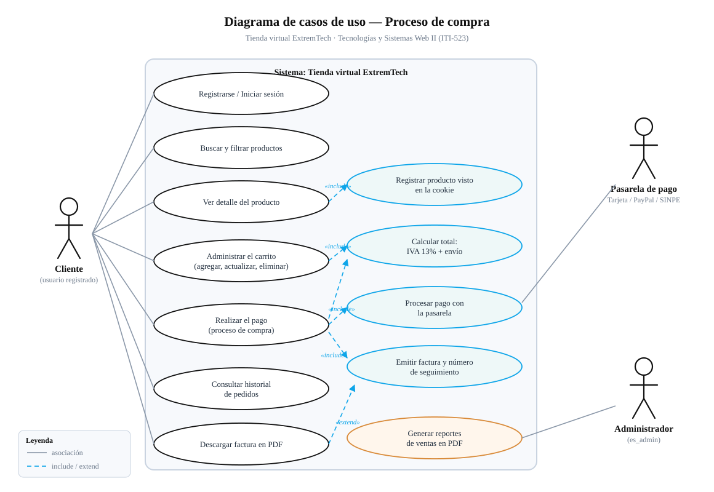
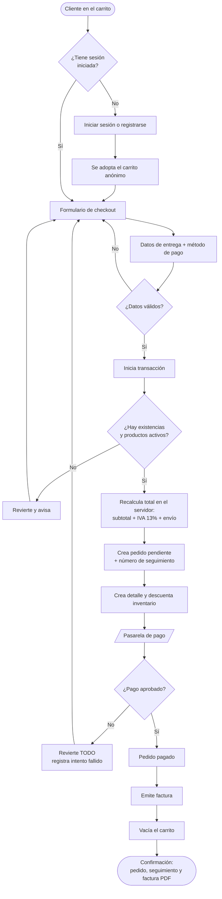

# Diagrama de caso de uso — Proceso de compra

Entregable solicitado en el documento del proyecto final.

> Archivo: [`diagrama-caso-uso-compra.svg`](diagrama-caso-uso-compra.svg)
> (ábralo con cualquier navegador; también se puede insertar en Word).

---

## 1. Actores

| Actor | Tipo | Descripción |
|---|---|---|
| **Cliente** | Principal | Usuario registrado que compra en la tienda. Inicia el proceso de compra. |
| **Pasarela de pago** | Secundario (sistema externo) | Autoriza o rechaza el cobro. En el proyecto son tarjeta, PayPal y SINPE Móvil. |
| **Administrador** | Principal | Usuario con `es_admin = true`. No participa en la compra, pero consume su resultado a través de los reportes. |

---

## 2. Casos de uso del proceso de compra

| # | Caso de uso | Descripción |
|---|---|---|
| CU-01 | Registrarse / Iniciar sesión | El cliente crea su cuenta o autentica. Es **precondición** del pago. |
| CU-02 | Buscar y filtrar productos | Búsqueda por nombre o marca y filtrado por categoría y rango de precio. |
| CU-03 | Ver detalle del producto | Descripción, precio, imagen y existencias. |
| CU-04 | Administrar el carrito | Agregar, actualizar cantidad y eliminar productos. |
| CU-05 | Realizar el pago | Datos de entrega, selección del método y confirmación de la compra. |
| CU-06 | Consultar historial de pedidos | Lista de compras con estado y número de seguimiento. |
| CU-07 | Descargar factura en PDF | Comprobante de una compra ya pagada. |
| CU-08 | Registrar producto visto (cookie) | *Incluido* por CU-03: guarda el id en la cookie `productos_vistos`. |
| CU-09 | Calcular total: IVA + envío | *Incluido* por CU-04 y CU-05: subtotal + 13% de IVA + envío. |
| CU-10 | Procesar pago con la pasarela | *Incluido* por CU-05. Se comunica con el actor **Pasarela de pago**. |
| CU-11 | Emitir factura y número de seguimiento | *Incluido* por CU-05, solo si el pago fue aprobado. |
| CU-12 | Generar reportes de ventas en PDF | Del **Administrador**: ventas por mes y por cliente. |

### Relaciones

- **«include»** (línea punteada): el caso base **siempre** ejecuta el incluido.
  Por ejemplo, «Realizar el pago» siempre incluye «Calcular total», «Procesar pago» y
  «Emitir factura».
- **«extend»** (línea punteada): comportamiento **opcional**. Descargar la factura en PDF
  extiende a la factura ya emitida: el cliente puede hacerlo o no.

---

## 3. Descripción detallada del caso de uso principal

### CU-05 — Realizar el pago (proceso de compra)

| Campo | Contenido |
|---|---|
| **Actor principal** | Cliente |
| **Actor secundario** | Pasarela de pago |
| **Precondiciones** | El cliente tiene sesión iniciada y su carrito tiene al menos un producto disponible. |
| **Postcondiciones (éxito)** | Existe un pedido en estado `pagado`, con su detalle, su factura y su número de seguimiento; el inventario quedó descontado y el carrito vacío. |
| **Postcondiciones (fallo)** | No existe ningún registro nuevo: el pedido, el detalle y el descuento de inventario se revierten. El carrito queda intacto. |

#### Flujo principal (camino de éxito)

| # | Actor | Sistema |
|---|---|---|
| 1 | Presiona «Continuar con el pago» en el carrito. | Verifica la sesión y que el carrito no esté vacío. Muestra el formulario con los datos del perfil precargados y el resumen de totales. |
| 2 | Completa los datos de entrega. | Valida nombre, teléfono, dirección, ciudad y provincia. |
| 3 | Elige el método de pago. | Muestra únicamente los campos de ese método y los marca como obligatorios. |
| 4 | Presiona «Pagar». | Abre una transacción de base de datos. |
| 5 | | Relee los productos con bloqueo y valida que estén activos y con existencias. |
| 6 | | **Recalcula el total en el servidor** con los precios de la base de datos. |
| 7 | | Crea el pedido en estado `pendiente` y genera el número de seguimiento. |
| 8 | | Crea el detalle del pedido y descuenta el inventario. |
| 9 | | Envía el cobro a la **pasarela de pago** y registra la transacción. |
| 10 | | La pasarela **aprueba** el cobro. |
| 11 | | Marca el pedido como `pagado`, emite la factura y vacía el carrito. |
| 12 | | Confirma la transacción y muestra la pantalla de confirmación con el número de pedido, el número de seguimiento, el monto y el enlace a la factura en PDF. |

#### Flujos alternativos

| Código | Situación | Respuesta del sistema |
|---|---|---|
| **A1** | El carrito está vacío. | Redirige al catálogo con el mensaje «Su carrito está vacío». |
| **A2** | El cliente no tiene sesión iniciada. | Lo envía a iniciar sesión y **conserva su carrito**, que se traslada a su cuenta al ingresar. |
| **A3** | Faltan datos o son inválidos. | Vuelve al formulario marcando cada campo con su mensaje. Los datos de la tarjeta **no** se repueblan. |
| **A4** | La pasarela **rechaza** el pago. | Revierte la transacción completa (paso 7 al 9), registra el intento fallido en `payments` y muestra el motivo. El carrito sigue disponible para reintentar. |
| **A5** | Un producto se agotó mientras estaba en el carrito. | Cancela la operación e indica cuántas unidades quedan. |
| **A6** | Un producto se desactivó del catálogo. | Cancela la operación e indica que ya no está disponible. |
| **A7** | El cliente altera el total enviado por el formulario. | Se ignora: el monto cobrado es siempre el que calcula el servidor. |

---

## 4. Diagrama en formato Mermaid

Versión editable del flujo, para quien prefiera regenerarlo:

---

## 5. Trazabilidad con las pruebas automatizadas

Cada flujo del caso de uso tiene su prueba en `tests/Feature/CheckoutTest.php`:

| Flujo | Prueba |
|---|---|
| Principal | `test_completa_la_compra_con_tarjeta` |
| Principal (factura) | `test_emite_la_factura_al_pagar` |
| Principal (inventario) | `test_descuenta_las_existencias_del_producto` |
| Principal (confirmación) | `test_la_confirmacion_muestra_el_seguimiento_y_el_monto` |
| A1 | `test_con_el_carrito_vacio_redirige_al_catalogo` |
| A2 | `test_el_checkout_exige_sesion_iniciada` y `AutenticacionTest::test_el_carrito_del_visitante_se_conserva_al_iniciar_sesion` |
| A3 | `test_valida_los_datos_de_envio`, `test_exige_los_datos_de_la_tarjeta_si_ese_es_el_metodo` |
| A4 | `test_si_la_tarjeta_es_rechazada_no_queda_ningun_pedido`, `test_si_paypal_rechaza_el_pago_no_queda_pedido` |
| A5 | `test_no_permite_comprar_mas_unidades_que_las_existentes` |
| A6 | `test_no_permite_comprar_un_producto_desactivado` |
| A7 | `test_el_total_se_calcula_en_el_servidor_y_no_se_puede_alterar` |
